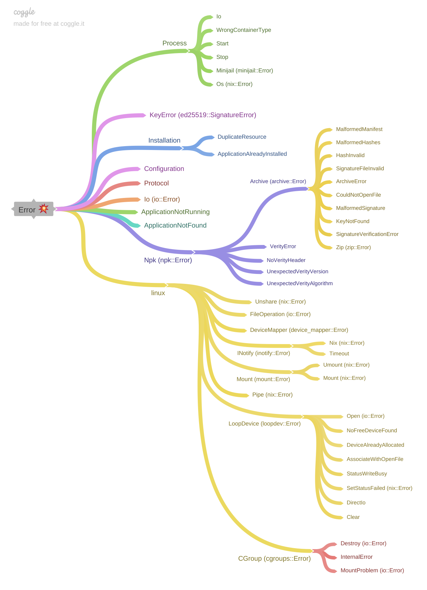

# Changelog
All notable changes to this project will be documented in this file.

The format is based on [Keep a Changelog](https://keepachangelog.com/en/1.0.0/),
and this project adheres to [Semantic Versioning](https://semver.org/spec/v2.0.0.html).

## [Unreleased]
### Changed
* Synchronize access to the loopback control file (run multiple northstar instances
  in parallel)
* Mount container in parallel
* Fix integration test log assumptions
* Use `api::client::Client` for interfacing the runtime in integration tests
* Add `api::client::Client::mount/umount`
* Remove the `install/uninstall` and `request` from `runtime::Runtime`
* Add UID and GID setting to the manifest. The values are used for preparing
  the squashfs image and when a container is started.
* Add a Rust API client that implements the Northstar API protocol. See
  `northstar::api::client`.
* Exchange the length encoded wire format with newline seperated json.
* Upgrade to Tokio 1.0
* Rename the default configuration file from north.toml to northstar.toml
* The `[directories]` section in the `north.toml` configuration file is replaced
  by multiple `[repositories.<name>]` sections. Where each corresponds to a
  directory previously specified in the `container_dirs` parameter. The
  specified `<name>` corresponds to the __repository identifier__.
* Each `[repositories.<name>]` section has a `dir`, `writable` and an optional
  `key` parameter. Where `dir` is the directory containing the `npk` files,
  `writable` indicates whether cotainers can be installed or uninstalled to this
  repository and `key` is the path to the public signature file.
* To install a container, a __repository identifier__ is required to indicate
  the destination where the container will be installed.
* If the `key` parameter is unspecified, the containers from the repository are
  mounted without being verified using `verity`.

## [0.6.0] - 2020-11-22
### Added
* Support for cross compilation for `musl`
* Check that run-dir and data-dir have correct rw permissions
* runtime can be correctly shut down

### Changed
* Rewrite of nstar for a better user experience
* Extract all npk handling to separate crate
* Simplified error types in runtime and API



### Removed
* Mock runtime support for MacOS

## [0.5.0] - 2020-11-2
### Added
* Notifications for system events are now sent to connected clients (e.g. to `nstar`)

### Changed
* Installation of packages:
  When a package is installed, it is now streamed to the northstar daemon
* Dedicated error types instead of generic anyhow errors
* Resource-Containers: now multiple versions are possible
* nstar is now implemented with tokio

### Removed
* ruby tooling for generating npks. `sextant` is now used for npk generation

## [0.4.0] - 2020-10-22
### Added
- Added sextant -- new command line utility to create npk-packages

### Changed
- Mounts ands resources are now specified together inside  the manifest's
  `mounts:` section. The format of the entries also changes.

  ```yaml
    mounts:
      - source: /lib
        target: /lib
        type: bind
      - source: /lib64
        target: /lib64
        type: bind
      - target: /data
        type: data
      - target: /data_rw
        type: data
        flags:
          - rw

    resources:
      - name: hello
        version: 0.1.2
        dir: /hello
        mountpoint: /message
  ```

  becomes:

  ```yaml
    mounts:
      /lib:
        host: /lib
      /lib64:
        host: /lib64
      /data: {}
      /data_rw:
        flags:
          - rw
      /message:
        resource: hello:0.1.2/hello
  ```

## [0.3.0] - 2020-10-21
### Changed
- nstar can now start/stop containers by regex

## [0.2.3] - 2020-10-12
### Changed
- Use mounts from manifest
  Bind mounts and data mounts are now specified in the manifest.
  Bind mounts are mounted as before. The data mounts in the
  mount list in the manifest is a replacement for the default
  data dir. The global data dir option is obsolete because this can
  be configured via a custom bind mount.
- The optional `OnExit` section was removed

## [0.2.2] - 2020-10-07
### Changed
- Change manifest env settings to a map
  Using a map for env variables in manifest feels more natural
  than a list.
  Instead of using a list here:
    env: [[THREADS, 4]]
  we now use a map
    env:
      THREADS: 4

## [0.2.1] - 2020-10-01
### Added
- Add shell script to check kernel config
  The shell script is meant as a guide for people configuring
  their kernel to run northstar. It attempts to check specific
  functionality provided by the various kernel config options.

### Changed
- Unmount verity devices on shutdown
  This change uninstalls every container on shutdown. This translates to an
  umount of the verity devices and removal of their mount point. A wait
  for the corresponding `/dev/dm-*` is performed afterward using `inotify`.
- Split runtime into lib and bin modules
- Move api and manifest to north crate

## [0.2.0] - 2020-09-28
### Added
- JSON based API that allows to control the north runtime remotely
- New command line client based on json api (nstar)
- rake-task to do a debug build

### Changed
- Usage of json api in console
- dcon -> nstar: We now use the uniqu id for start/stop/uninstall
  (no regex is constructed anymore)
  makes it unambigous which component is meant

### Removed
- Old dcon client
