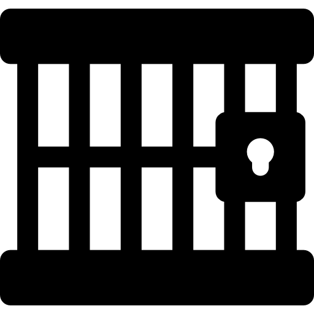
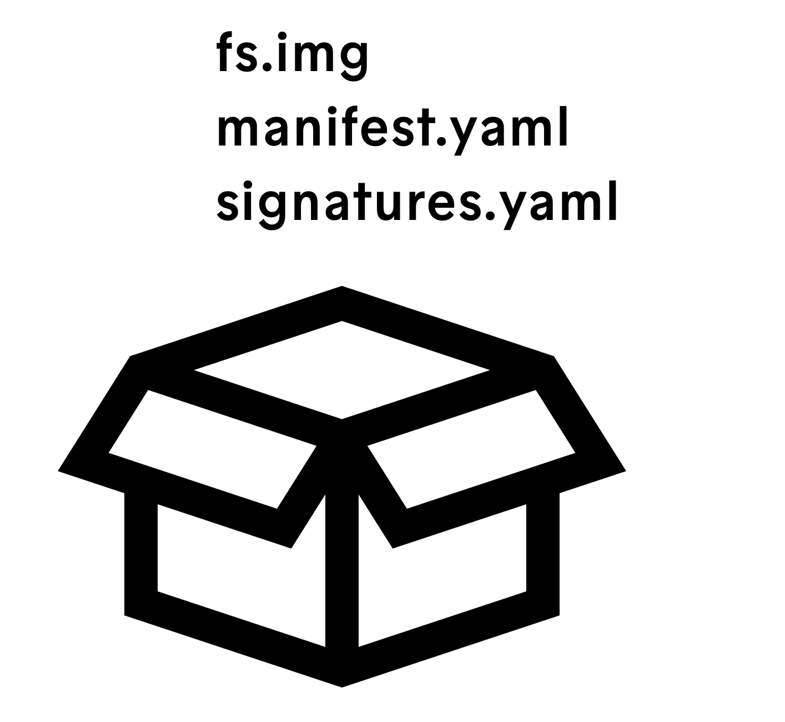
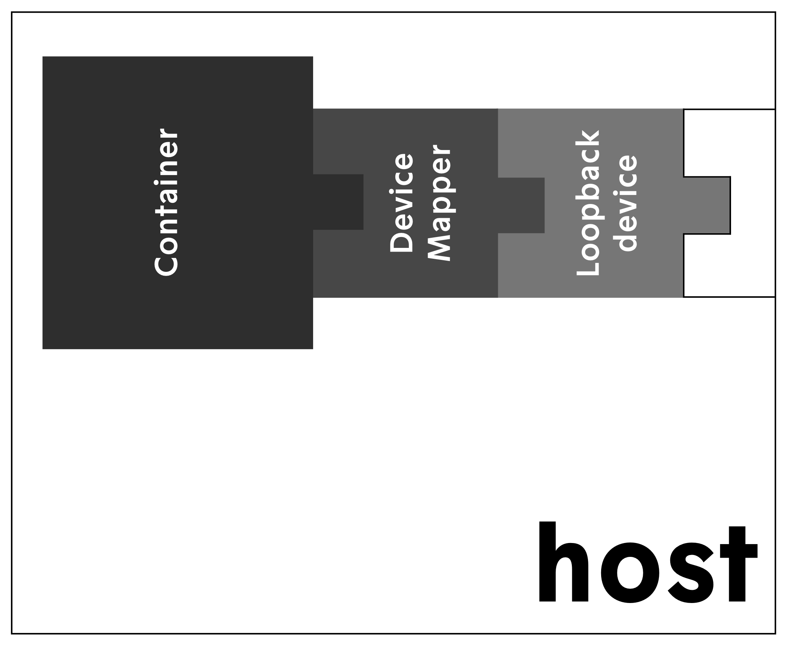

[](LICENSE.md)
[](https://github.com/esrlabs/northstar/actions)
[](https://github.com/esrlabs/northstar/actions)


# Minimal and secure containers for edge computing

Northstar is an open source technology for securely running self sufficient sandboxed containers in a ressource constraint environment. It offers a runtime that monitors isolated containers. In addition it provides tooling to create and manage those containers.

At its core, Northstar makes extensive use of sandboxing to isolate applications from the rest of the system while at the same time orchestrating efficient startup and secure update scenarios. Such applications run inside Northstar-containers and only rely on system services and ressource containers provided by the Northstar-platform. Similar sandboxing techniques were selected and used as are found in Docker and other containerization approaches to reach maximum isolation. To build the most efficient and robust solution, Northstar is completely developed in Rust, a language designed to afford the performance of C++ while at the same time guaranteeing memory safety.

## Northstar Status

Northstar is still under heavy development. While we already have implemented most of the basic building blocks, Northstar is not production ready.

So far we tested Northstar on

* aarch64-linux-android
* aarch64-unknown-linux-gnu
* x86_64-unknown-linux-gnu

### Everything that is checked is implemented

- [x] On-the-fly verification of container content
- [x] Process supervision: memory control (using cgroups)
- [x] Process supervision: cpu control (using cgroups)
- [x] Limiting system calls (whitelist)
- [x] Shared resource containers
- [x] chroot environment - every process only sees it's own environment
- [ ] User-support of configuring and managing network-namespaces
- [ ] Dedicated UID for each container
- [x] Management API of the runtime
- [x] Signature Check of NPK [#54](https://github.com/esrlabs/northstar/issues/54)
- [ ] PID Namespaces [#51](https://github.com/esrlabs/northstar/issues/51)

<br/>

## Supported Sandboxing features

* limited read/write access: a container can only access it's own data
* restrict memory usage of a container
* restrict CPU usage
* limitation of network communication
* containerized applications can only use whitelisted syscalls

## Integrity features

* secure update of verified packages
* secure boot
* verification on each read access prevents manipulation

## How do Northstar images/containers work

### Northstar Packages (NPK)

Similar as in the docker world, a Northstar **image** is the unit that gets deployed into a system. Once the runtime starts, all images in the repositiry will be loaded into **containers**. Containers are the entities that are managed by the Northstar runtime.

Images are packaged as **Northstar Packages** or **NPK**s. At it's outer layer, such an NPK is just a plain zip-archive. The content looks like this:

<br/>

The `manifest.yaml` contains essential information about the package like id and version.

This is what a typical manifest looks like (taken from the examples)

```yaml
name: ferris_says_hello
version: 0.0.1
init: /bin/ferris
args:
  - /message/hello
mounts:
    /dev: full
    /lib:
      host: /lib
    /lib64:
      host: /lib64
    /system:
      host: /system
    /bin:
      resource: ferris:0.0.2/
    /message:
      resource: hello_message:0.1.2/
    /data: persist
```

The `signature.yaml` contains signatures that are used to verify the package and the included file system. It is automatically created by the tooling.

Now the actual content is the `fs.img` file, which is a squashfs filesystem image that contains the actual content of what the user puts into a container.
The image is packed a an zip archive with zero compression. Compression takes place via the SquashFS
functionality. Not compression the outer package allows Northstar to access the content without
unpacking the image to disk.

### Installing a package

<br/>

A file system image of a Nortstar package is attached to a loopback device. The loopback device is used to setup a verity check block device with the dm-verity module. The verity hashes are appended to the file system image. The verity block device is finally mounted and used in operation.

## Creating Northstar Packages

In order to use an application in a northstar container, it needs to be packaged in a northstar package (NPK). The `sextant` tool can be used to create and package npk files

```shell
Northstar CLI

USAGE:
    sextant <SUBCOMMAND>

FLAGS:
    -h, --help       Prints help information
    -V, --version    Prints version information

SUBCOMMANDS:
    gen-key
    help       Prints this message or the help of the given subcommand(s)
    inspect    Print information about a Northstar container
    pack       Pack Northstar containers
    unpack     Unpack Northstar containers
```

In order to create your own northstar packages, you will also need to generate a keypair that
subsequently will be used to generate and verify the signatures of your images.

Once the packages are created, they are stored in a repository directory. This repository needs to be configured later when starting the northstar runtime.

## Configuring and Running Northstar

### System Requirements

Northstar is designed to be running a modern linux environment. When the kernel has the required features, it is basically possible to use northstar.
Required Kernel features are:

* device-mapper with dm-verity
* SquashFS
* loopback-blockdevice-support
* PID namespaces
* mount namespaces

The script in `doc/tools/check_conf.sh` can be used to check your running kernel for the correct configuration. The version provided is for Android, but can be adapted to any platform providing the shell on the platform supports arrays.


### Build Northstar
Open a terminal, clone the repository and build the solution and start the runtime:

    $ git clone https://github.com/esrlabs/northstar.git
    $ cargo build --release --bin north
    $ cargo build --release --bin nstar
    $ ./examples/build_examples.sh
    $ sudo ./target/release/north

### Run sample code
Open a second terminal navigate to the directory where the northstar source is located. Start `nstar` to interact with the runtime.
Execute the following commands:

1. `containers` to list all registered containers
2. `start crashing` to start an example container which will crash within the next 10 seconds

[//]: #


    $ ./target/release/nstar
    $ >> containers
    Name              | Version | Type     | PID | Uptime
    -------------------+---------+----------+-----+--------
    cpueater          | 0.0.1   | App      |     |
    crashing          | 0.0.1   | App      |     |
    datarw            | 0.0.1   | App      |     |
    ferris_says_hello | 0.0.3   | App      |     |
    hello             | 0.0.2   | App      |     |
    memeater          | 0.0.1   | App      |     |
    ferris            | 0.0.2   | Resource |     |
    hello_message     | 0.1.2   | Resource |     |
    >> start crashing
    crashing-0.0.1 was started
    start succeeded
    >> crashing-0.0.1 exited (Exited with code 101)


### Starting Northstar

The Northstar runtime is an executable and usually run as a daemon started by your system manager of choice. It can be started with a config file.

```shell
Northstar

USAGE:
    northstar [FLAGS] [OPTIONS]

FLAGS:
    -d, --debug      Print debug logs
    -h, --help       Prints help information
    -V, --version    Prints version information

OPTIONS:
    -c, --config <config>    File that contains the northstar configuration [default: northstar.toml]
```

The configuration of the runtime is done with a `*.toml` configuration file.
Here is an example:

```toml
debug = true
console_address = "localhost:4200"
container_uid = 1000
container_gid = 1000
run_dir = "target/northstar/run"
data_dir = "target/northstar/data"

[repositories.default]
dir = "target/northstar/repository"
writable = true
key = "examples/keys/northstar.pub"


[cgroups]
memory = "northstar"
cpu = "northstar"

[devices]
unshare_root = "/"
unshare_fstype = "ext4"
loop_control = "/dev/loop-control"
loop_dev = "/dev/loop"
device_mapper = "/dev/mapper/control"
device_mapper_dev = "/dev/dm-"

[bridge]
enabled = true;
ipv4_slash16 = "172.30.0.0"
```

The `[repositories.default]` sections describes a container repository named `default`.
Within it, the following options can be specified:

* **`dir`** -- The directory where to find `*.npk` packages for the correct architecture.
* **`key`** -- The path to the public signing key used to sign the containers.

Multiple `[repositories.<name>]` sections can be specified for separate
repositories, where `<name>` is the __repository identifier__.

The [`cgroups`] optionally configures northstar applications CGroups settings.
Both `memory` and `cpu` will tell northstar where to mount the cgroup hierarchies.

`[devices]`-section:

* **`unshare_root`** -- Set to mountpoint of the fs containing run_dir. The runtime needs this directory to set the mount propagation to MS_PRIVATE.
* **`unshare_fstype`** -- For applying the mount propagation type the fs type is needed.
* **`loop_control`** -- Location of the loopback block device control file
* **`loop_dev`** -- Prefix of preconfigured loopback devices. Usually loopback devices are e.g /dev/block0
* **`device_mapper`** -- Device mapper control file.
* **`device_mapper_dev`** -- Prefix of device mapper mappings.
* **`run_dir`** -- where the container content will be mounted
* **`data_dir`** -- In data_dir a directory for each container is created if a mount of type data is used in the manifest


The `[bridge]`-section is required if any container uses network namespaces or a VM.
* **`enabled`** -- create a bridge in the root namespace using the specified /16 IPv4 address.
* **`ipv4_slash16`** -- Set to the base class B IPv4 address to use for the bridge for network namespaces. This must be a /16 address such as 172.30.0.0. The bridge will be assigned an IP address of x.x.0.1 . Each namespace will have it's own separate subnet, and have a specific address of x.x.<subnet>.10 . A VM in the namespace will have a specific address of x.x.<subnet>.20. See [network_namespaces](doc/network.txt)

## Controlling the runtime

The northstar runtime can be controlled our `nstar` application or from a custom application. You can

- start and stop containers
- uninstall or upgrade containers
- query information about running processes and setttings
- ...
With `nstar` we include a commandline interface that can be used to issue commands to the runtime. Underneth all communication happends via protocol-buffer objects over sockets (see [the runtime API README](north_common/README.md))

## Examples

If you want to see how containers can look like, take a look at the examples in the examples directory.
See [our examples README](examples/README.md)

<br/>

## For Northstar Devs

See [HACKING](HACKING.md) for more on what you might need.
