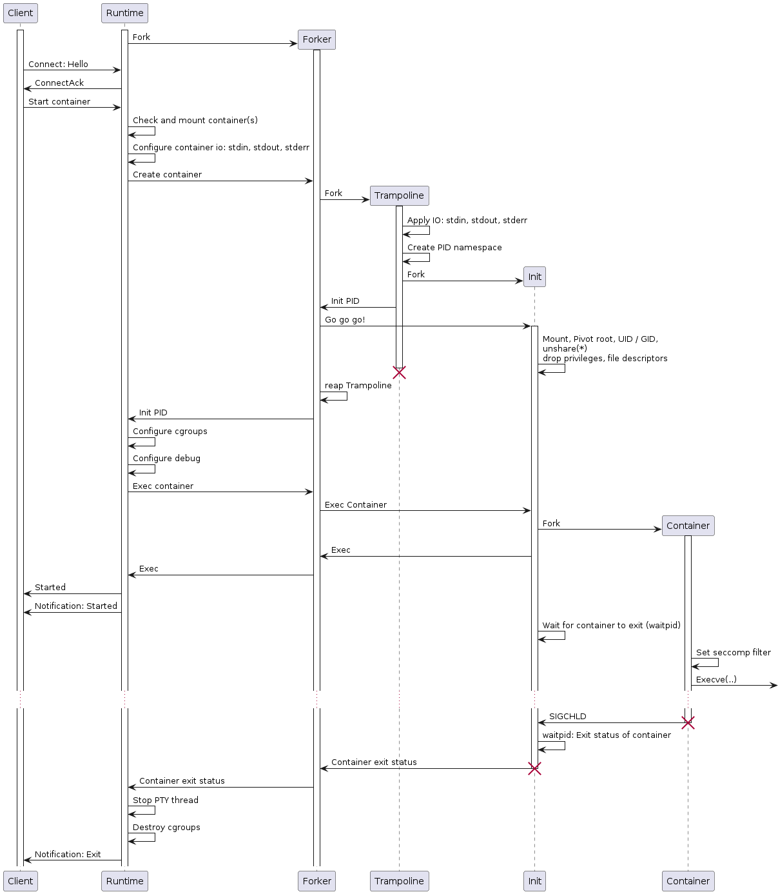

[](https://esrlabs.github.io/northstar/northstar/index.html)


<br/>
<p align="center">
  <h1 align="center">Northstar</h1>
  <p align="center">
    Northstar is an embedded container runtime prototype for Linux.
    <br/>
    ·
    <a href="https://github.com/esrlabs/northstar/issues">Report Bug</a>
    ·
    <a href="https://github.com/esrlabs/northstar/issues">Request Feature</a>
    ·
    <br/>
    <br/>
    <a href="https://github.com/esrlabs/northstar">
        
    </a>
  </p>
</p>

<details open="open">
  <summary><h2 style="display: inline-block">Table of Contents</h2></summary>
  <ol>
    <li>
      <a href="#about">About</a>
      <ul>
        <li><a href="#containers">Containers</a></li>
        <li><a href="#processes">Processes</a></li>
        <li><a href="#comparison">Comparison</a></li>
      </ul>
    </li>
    <li><a href="#quickstart">Quickstart</a></li>
    <li>
      <a href="#configuration">Configuration</a>
      <ul>
        <li><a href="#repositories">Repositories</a></li>
      </ul>
    </li>
    <li><a href="#integration-tests">Integration Tests</a></li>
    <li><a href="#portability">Portability</a></li>
    <li><a href="#internals">Internals</a>
      <ul>
        <li><a href="#container-launch-sequence">Container launch sequence</a></li>
        <li><a href="#manifest-format">Manifest format</a></li>
      </ul>
    </li>
    <li><a href="#roadmap">Roadmap</a></li>
    <li><a href="#contributing">Contributing</a></li>
    <li><a href="#license">License</a></li>
    <li><a href="#contact">Contact</a></li>
    <li><a href="#acknowledgements">Acknowledgements</a></li>
  </ol>
</details>

## About

Northstar is an open source embedded container runtime optimized for speed and
resource usage. Northstar combines several standard Linux process isolation and
sandboxing features to gain a medium level of isolation between
containers/processes. The Northstar runtime consists out of two parts: The
container handling and process spawning. To build the most efficient and robust
solution, Northstar is completely developed in Rust, a language designed to
afford the performance of C/C++ without their footguns.

The [Northstar - Embedded Container
Runtime](doc/Northstar%20-%20Embedded%20Container%20Runtime.pdf) whitepaper
describes the motivation and initial concepts and ideas of Northstar.

Security is a strong concern and hard to achieve. Northstar uses tons of OS
interfaces with room for mistakes security and stability wise. This
[report](doc/Cure53%20ESR-01-report.pdf) describes the results of a security
assessment of the Northstar Embedded Linux Container Runtime. Carried out by
[Cure53](https://cure53.de) in August 2022, the project included a penetration
test and a dedicated audit of the source code. Outcome and actions take are
documented in the projects [issue
tracker](https://github.com/esrlabs/northstar/issues?q=label%3Aaudit_0822+)
label
[audit_0822](https://github.com/esrlabs/northstar/issues?q=label%3Aaudit_0822+).

### Containers

Northstar containers are called `NPK`. The NPK format is heavily inspired by the
[Android APEX](https://source.android.com/devices/tech/ota/apex) technology. A
Northstar container contains:

* Root filesystem in a [Squashfs](https://github.com/plougher/squashfs-tools)
  file system image (optionally compressed)
* Northstar manifest with process configuration and container meta information

Northstar containers can be created with the Northstar utility
[sextant](northstar-sextant/README.md).

### Processes

Started Northstar containers are Linux processes. The attributes and environment
for a spawned container is described in a container manifest which is included
in a NPK. The container manifest allows to configure the following Linux
subsystems and features:

* Arguments passed to the containers init
* Environment variables set in the container context
* User and group id
* Mount namespace
* PID namespace
* IPC namespace
* UTS namespace
* Cgroups memory (optional)
* CGroups CPU (optional)
* Additional bind mounts (optional)
* Capabilities (optional)
* Stdout/stderr handling (optional)
* Seccomp configuration (optional)

### Comparison

* Northstar containers are not portable and are tailored to a known system (uid/gid/mounts...)
* **TODO**

## Quickstart

Northstar is written in [Rust](https://www.rust-lang.org). The minimum supported
Rust version (MSRV) is *1.63*. Rust is best installed and managed by the rustup
tool. Rust has a 6-week rapid release process and supports a great number of
platforms, so there are many builds of Rust available at any time. rustup
manages these builds in a consistent way on every platform that Rust supports,
enabling installation of Rust from the beta and nightly release channels as well
as support for additional cross-compilation targets.

Building Northstar is limited to Linux systems and runs on Linux systems **only**!
The Northstar build generates bindings for various system libraries and uses the
`mksquashfs` command line tool for NPK creation.

Install build dependencies on Debian based distributions by running

```sh
sudo apt-get install build-essential libclang1 squashfs-tools
```

The `squashfs-tools` package is required in version **4.5** or higher.

Northstar comes with a set of [examples](./examples) that demonstrate most of
the Northstar features. Building the example binaries and packing its
corresponding NPKs is done via:

```sh
./examples/build_examples.sh
```

Building and starting the [example runtime main](./main/src/main.rs) is
triggered by a

```sh
cargo run --bin northstar
```

The Northstar workspace configuration configures a cargo
[runner](.cargo/runner-x86_64-unknown-linux-gnu) that invokes the runtimes
example main binary with super user rights.

Use the [northstar-nstar](./northstar-nstar) utility to inspect and modify the
runtimes state e.g.

```sh
cargo build --release --bin northstar-nstar
...
./target/release/northstar-nstar --help
...
> ./target/release/northstar-nstar -j start hello-world
{"Response":{"Err":{"StartContainerStarted":{"name":"hello-world","version":"0.0.1"}}}}
> ./target/release/northstar-nstar -j kill hello-world
{"Response":{"Ok":null}}
```

## Configuration

The example executable `northstar` reads a configuration file that represents
`northstar_runtime::runtime::config::Config`.

```toml
# Directory where containers are mounted
run_dir = "target/northstar/run"
# Directory for `persist` mounts of containers
data_dir = "target/northstar/data"
# Log directory for debug logs and traces
log_dir = "target/northstar/logs"
# Top level cgroup name
cgroup = "northstar"
# Event loop buffer size
event_buffer_size = 256
# Notification buffer size
notification_buffer_size = 64
# Device mapper device timeout
device_mapper_device_timeout = "2s"
# Token validity
token_validity = "1m"
# Loop device timeout
loop_device_timeout = "2s"

# Debug TCP console on localhost with full access
# [debug]
# console = "tcp://localhost:4200"
# Start a `strace -p PID ...` instance after a container is started.
# The execution of the application is deferred until strace is attached.
[debug.strace]
# Configure the output of the strace instance attached to a started
# application. "file" for a file named strace-<PID>-name.log or "log"
# to forward the strace output to the runtimes log.
output = "log"
# Optional additional flags passed to `strace`
flags = "-f -s 256"
# Optional path to the strace binary
path = /bin/strace
# Include the runtime system calls prior to exeve
include_runtime = true

# Start a `perf record -p PID -o LOG_DIR/perf-PID-NAME.perf FLAGS` instance
# after a container is started.
[debug.perf]
# Optional path to the perf binary
path = "/bin/perf"
# Optional additional flags passed to `perf`
flags = ""

# NPK Repository `memory` configuration. This is a not persistent in memory repository
[repositories.memory]
type = "mem"
# Optional key for this repository.
key = "examples/northstar.pub"
# Maximum number of containers that can be stored in this repository.
capacity_num = 10
# Maximum total size of all containers in this repository.
capacity_size = "10 MB"

# NPK Repository `default` in `dir`
[repositories.default]
type = { fs = { dir = "target/northstar/repository" }}
# Optional key for this repository.
key = "examples/northstar.pub"
# Mount the containers from this repository on runtime start. Default: false
mount_on_start = true
```

### Repositories

A repository is an entity that is able to store NPK's at runtime. Repositories
are configured at initialization time of the runtime. The repository
configuration cannot be changed at runtime. Each configured repository has a
unique identifier
[id](https://esrlabs.github.io/northstar/northstar/api/model/type.RepositoryId.html).
Currently two types of repositories exists: `fs` and `mem`.

The `fs` type repositories are backed by file system storage. The configured
directory (`dir`) is used to store NPK's. If this directory is read only, no
additional install requests can be performed at runtime. If a `fs` repository
configuration contains a `key` field, the repository is treated as "verified".
The configured key is used to verify the signature of the containers manifest
and it's verity root hash. When the container is mounted, the verity root hash
is used to configure a device mapper verity devices that is mounted instead of
the contained Squashfs image.

Repositories without a `key` are treated as trustful sources. No signature
checks are performed. The root filesystem is mounted *without* verity. A
possibly present verity root hash with in the NPK is ignored. Trusted
repositories should be verified and read only file systems.

Set the `mount_on_start` flag of a `fs` repository to `true` to make the runtime
mount *all* containers present at startup. The mount operations are done in
parallel.

The `mem` type repositories use
[memfd](https://man7.org/linux/man-pages/man2/memfd_create.2.html) for their
storage. No data is persistently stored during an installation of a container.
Obviously it's not possible to have NPK's preinstalled in a `mem` repository at
runtime startup. The `mem` repositories are mainly used for testing.

## Console

Northstar uses **JSON** to encode the messages shared with clients. The messages
are newline delimited. This is a common approach that facilitates clients being
implemented in any programming language.  However, Northstar as a library,
provides a convenient
[Client](https://esrlabs.github.io/northstar/northstar/api/client/struct.Client.html)
type that can be used for a simpler client implementation using **Rust**.

Details about the Northstar console are [here](doc/console.md). A good starting
point is to run the `northstar-nstar` tool with the `-j` flag that. This
instructs `northstar-nstar` to display the raw json payload exchanged with the
runtime.

Details about the model used as json payload are found
[here](https://esrlabs.github.io/northstar/northstar/api/model/index.html).

## Integration tests

Integration tests start a runtime instance and assert on log output of
container of notification sent from the runtime. The testsuite is invoked by the
Rust test system:

```sh
cargo test -p northstar-tests
```

and are executed by the project [CI](https://github.com/esrlabs/northstar/actions).

## Portability

Northstar makes extensive use of Linux Kernel features and runs on Linux systems
only. Northstar is tested on the architectures

* `aarch64-linux-android`
* `aarch64-unknown-linux-gnu`
* `aarch64-unknown-linux-musl`
* `x86_64-unknown-linux-gnu` aka `Linux Desktop`

Northstar cannot be run on 32 bit systems! In order to verify that all needed
Kernel features are available, either run the
[check_conf](./check_conf.sh) script or manually compare the target's
kernel configuration with the `CONFIG_` entries in the `check_conf.sh` script.

**TODO**: List required `CONFIG_` items here. The check_config script runs on
*Android only

### Runtime permissions

The Northstar runtime requires privileged rights on the host system. The rights
can be granted either by running Northstar as `root` *or* ensure the following
list of
[capabilities(7)](https://man7.org/linux/man-pages/man7/capabilities.7.html):

* `cap_chown`: change ownership of container directories
* `cap_dac_override`: lazy workaround for permissions on `/dev/mapper/control`
  and `cgroups`. Do not use in production!
* `cap_kill`: send signals to container inits
* `cap_setgid`: supplementary groups
* `cap_setpcap`: drop capabilities
* `cap_setuid`: user id
* `cap_sys_admin`: `mount`, `umount`, setns
* `cap_sys_resource`: increase `rlimits` (init)

## Internals

### Container launch sequence

<br/>

### Manifest Format

The manifest format is described [here](https://esrlabs.github.io/northstar/northstar/npk/manifest/struct.Manifest.html).

#### Mounts

The options of a mount entry in the manifest are optional. To apply one of the
mount options `rw`, `noexec`, `nosuid`, `nodev` or `rec` it must be explicitly set.

The default for a `bind` and `tmpfs` mount is *read only*. Mounts that are `rw` are
usually hard to handle from an integration point of view (SELinux and
permissions). Nevertheless - here's the example how to mount the host systems
`/tmp` directory to `/tmp`. The bind mount is *not* remounted `ro`. Note that
`ro` bind mounts require two mount operations.

```yaml
/tmp:
  type: bind
  host: /tmp
  options: rw, nosuid, noexec
```

Resource containers *cannot* be mounted `rw`. The filesystem of resource
containers is squashfs which is not writeable. Resource containers can be
mounted without the `noexec` flag in order to provide binaries.

Example resource mount with the executable flag set but `nodev` and `nosuid`
set (optional):

```yaml
/bin/java:
  type: resource
  name: java13
  version:
  dir: /
  options: nodev, nosuid
```

Example `tmpfs` mount. `tmpfs` mounts are never `ro` ;-):

```yaml
/tmpfs:
  type: tmpfs
  size: 20M
```

Mounts of type `persist` are support from the runtime for containers. The runtime
takes care to mount a *read* and *writeable* directory into the containers fs. The
directory is dedicated to this container. The directory is not shared with other
containers.

TODO: When are the directories removed? See
[#560](https://github.com/esrlabs/northstar/issues/560)

```yaml
/data:
  type: persist
```

To provide a `minimal` `/dev` file system to the container, add a mount entry of
type `dev`.

```yaml
/dev:
  type: dev
```

to the manifest. The `/dev` is populated with *only*:

* `full`
* `null`
* `random`
* `tty`
* `urandom`
* `zero`

If the container binary needs more devices, bind mount the host systems `/dev`.

#### Seccomp

Northstar supports
[Seccomp](https://www.kernel.org/doc/Documentation/prctl/seccomp_filter.txt)
to filter syscalls of containers.
The easiest way to add seccomp to a container is to add the `default` profile
to the container's manifest:

```toml
seccomp:
  profile:
    default
```

The `default` profile is similar to
[Docker's default profile](https://docs.docker.com/engine/security/seccomp/).

More specific seccomp rules that target filter syscalls are possible.
For example, the following manifest entry allows the `default` profile as well
as the
[delete_module](https://man7.org/linux/man-pages/man2/delete_module.2.html)
syscall, if its second argument equals `1` or matches the mask `0x06`.

```toml
seccomp:
  profile:
    default
  allow:
    delete_module: !args
      index: 1
      values: [
          1,
      ]
      mask: 0x06
```

The complete format of the seccomp manifest entry is described
[here](https://esrlabs.github.io/northstar/northstar/seccomp/struct.Seccomp.html).

If seccomp is defined in the manifest and the container attempts to access a
syscall that is not on the list of allowed calls the process is terminated
immediately.

## Roadmap

See the [open issues](https://github.com/esrlabs/northstar/issues) for a list of
proposed features and known issues).

## Questions and Help

Ask us questions about anything related to Northstar! To add your question,
[create an issue](https://github.com/esrlabs/northstar/issues) in this
repository.

Just a few guidelines to remember before you ask a question:

* Ensure your question hasn't already been answered. If it has been answered but
  the answer does not satisfy you, feel free to comment in the issue and we
  will re-open it.
* Use a succinct title and description. Add as *much* information as possible e.g
  manifests, npks, applications...
* If your question has already been asked and answered adequately, please add a
  thumbs-up (or the emoji of your choice!) to the issue. This helps us in identifying
  common problems that people usually face.
* Lastly, be civil, polite and patient. :)

## Contributing

Contributions are what make the open source community such an amazing place to
learn, inspire, and create. Any contributions you make are **greatly
appreciated**.

1. Fork the Project
2. Create your Feature Branch (`git checkout -b feature/AmazingFeature`)
3. Commit your Changes (`git commit -m 'Add some AmazingFeature'`)
4. Push to the Branch (`git push origin feature/AmazingFeature`)
5. Open a Pull Request

## License

Distributed under the Apache 2.0 License. See [LICENSE](LICENSE.txt) for more information.

## Contact

Project Link: [https://github.com/esrlabs/northstar](https://github.com/esrlabs/northstar)

## Acknowledgements

* [The Rust Community](https://users.rust-lang.org) for providing
  [crates](./northstar/Cargo.toml) that form the foundation of Northstar
* [The Android Open Source Project](https://source.android.com) for the APEX inspiration
* [youki](https://github.com/containers/youki) for solving similar problems
* [The manpage project](https://man7.org/linux/man-pages/dir_section_2.html)
  for documenting the weird world of system calls
