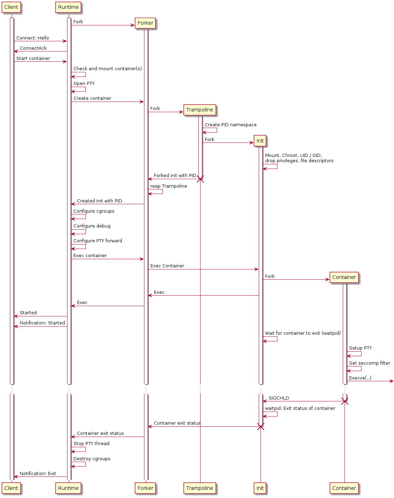

<br/>
<p align="center">
  <h1 align="center">Northstar</h1>
  <p align="center">
    Northstar is an opinionated embedded container runtime prototype for Linux.
    <br/>
    ·
    <a href="https://github.com/esrlabs/northstar/issues">Report Bug</a>
    ·
    <a href="https://github.com/esrlabs/northstar/issues">Request Feature</a>
    ·
    <br/>
    <br/>
    <a href="https://github.com/esrlabs/northstar">
        
    </a>
  </p>
</p>

<details open="open">
  <summary><h2 style="display: inline-block">Table of Contents</h2></summary>
  <ol>
    <li>
      <a href="#about">About</a>
      <ul>
        <li><a href="#containers">Containers</a></li>
        <li><a href="#processes">Processes</a></li>
        <li><a href="#comparison">Comparison</a></li>
      </ul>
    </li>
    <li><a href="#quickstart">Quickstart</a></li>
    <li>
      <a href="#configuration">Configuration</a>
      <ul>
        <li><a href="#repositories">Repositories</a></li>
      </ul>
    </li>
    <li><a href="#integration-tests">Integration Tests</a></li>
    <li><a href="#portability">Portability</a></li>
    <li><a href="#internals">Internals</a>
      <ul>
        <li><a href="#container-launch-sequence">Container launch sequence</a></li>
        <li><a href="#manifest-format">Manifest format</a></li>
      </ul>
    </li>
    <li><a href="#roadmap">Roadmap</a></li>
    <li><a href="#contributing">Contributing</a></li>
    <li><a href="#license">License</a></li>
    <li><a href="#contact">Contact</a></li>
    <li><a href="#acknowledgements">Acknowledgements</a></li>
  </ol>
</details>


## About

Northstar is an open source embedded container runtime optimized for speed and
resource usage. Northstar combines several standard Linux process isolation and
sandboxing features to gain a medium level of isolation between
containers/processes. The Northstar runtime consists out of two parts: The
container handling and process spawning. To build the most efficient and robust
solution, Northstar is completely developed in Rust, a language designed to
afford the performance of C/C++ without their footguns.

#### Containers

Northstar containers are called `NPK`. The NPK format is heavily inspired by the
[Android APEX](https://source.android.com/devices/tech/ota/apex) technology. A
Northstar container contains:

* Root filesystem in a [Squashfs](https://github.com/plougher/squashfs-tools)
  file system image (optionally compressed) Northstar manifest with container
* Northstar manifest with process configuration and container meta information

Northstar containers can be created with the Northstar utility
[sextant](tools/sextant/README.md).

#### Processes

Started Northstar contains are Linux processes. The attributes and environment
for a spawned container is described in a container manifest which is included
in a NPK. The container manifest allows to configure the following Linux
subsystems and features:

* Arguments passed to the containers init
* Environment variables set in the container context
* User and group id
* Mount namespace
* PID namespace
* Cgroups memory (optional)
* CGroups CPU (optional)
* Additional bind mounts (optional)
* Capabilities (optional)
* Stdout/stderr handling (optional)
* Seccomp configuration (optional)

### Comparison

**TODO**

* Northstar containers are not portable and are tailored to a known system (uid/gid/mounts...)
* ...

## Quickstart

Northstar is written in [Rust](https://www.rust-lang.org). The minimum supported
Rust version (MRSV) is *1.56*. Rust is best installed and managed by the rustup
tool. Rust has a 6-week rapid release process and supports a great number of
platforms, so there are many builds of Rust available at any time. rustup
manages these builds in a consistent way on every platform that Rust supports,
enabling installation of Rust from the beta and nightly release channels as well
as support for additional cross-compilation targets.

Building Northstar is limited to Linux systems and runs on Linux systems **only**!
The Northstar build generates bindings for various system libraries and uses the
`mksquashfs` command line tool for NPK creation.

Install build dependencies on Debian based distributions by running

```sh
sudo apt-get install build-essential libclang1 squashfs-tools
```

The `squashfs-tools` are required in version **4.6** or higher.

Northstar comes with a set of [examples](./examples) that demonstrate most of
the Northstar features. Building the example binaries and packing its
corresponding NPKs is done via 

```sh
./examples/build_examples.sh
```

Building and starting the [example runtime main](./main/src/main.rs) is triggered by a 

```sh
cargo run --bin northstar
```

The Northstar workspace configuration configures a cargo
[runner](.cargo/runner-x86_64-unknown-linux-gnu) that invokes the runtimes
example main binary with super user rights.

Use the [nstar](./tools/nstar/README.md) utility to inspect and modify the
runtimes state e.g

```sh
cargo build --release --bin nstar 
...
./target/release/nstar --help 
...
> ./target/release/nstar -j start hello-world
{"Response":{"Err":{"StartContainerStarted":{"name":"hello-world","version":"0.0.1"}}}}
> ./target/release/nstar -j kill hello-world
{"Response":{"Ok":null}}
```

## Configuration

The example executable `northstar` reads a configuration file that represents
`northstar::runtime::config::Config`.

```toml
# Console adresses
console = ["tcp://localhost:4200"]
# Directory where containers are mounted
run_dir = "target/northstar/run"
# Directory for `persist` mounts of containers
data_dir = "target/northstar/data"
# Log directory for debug logs and traces
log_dir = "target/northstar/logs"
# Number of paralllel mounts possible
mount_parallel = 10
# Top level cgroup name
cgroup = "northstar"

# Start a `strace -p PID ...` instance after a container is started.
# The execution of the application is deferred until strace is attached.
[debug.strace]
# Configure the output of the strace instance attached to a started
# application. "file" for a file named strace-<PID>-name.log or "log"
# to forward the strace output to the runtimes log.
output = "log"
# Optional additional flags passed to `strace`
flags = "-f -s 256"
# Optional path to the strace binary
path = /bin/strace
# Include the runtime system calls prior to exeve
include_runtime = true

# Start a `perf record -p PID -o LOG_DIR/perf-PID-NAME.perf FLAGS` instance
# after a container is started.
[debug.perf]
# Optional path to the perf binary
path = "/bin/perf"
# Optional additional flags passed to `perf`
flags = ""

# NPK Repository `memory` configuration. This is a not persistent in memory repository
[repositories.memory]
key = "examples/northstar.pub"
type = "mem"

# NPK Repository `default` in `dir`
[repositories.default]
key = "examples/northstar.pub"
type = { fs = { dir = "target/northstar/repository" }}
```

### Repositories

**TODO**: Describe what a repository is and what are the attributes: with/without key/verity, etc...

## Console

Northstar uses **JSON** to encode the messages shared with clients. The messages
are newline delimited. This is a common approach that facilitates clients being
implemented in any programming language.  However, Northstar as a library,
provides a convenient `api::client::Client` (**TODO**: Add rustdoc link) type that
can be used for a simpler client implementation using **Rust**. Northstar
interacts with clients through a `TCP` socket bound to each address configured
in `runtime::config::Config::console`.

* **TODO**: Move client guide part to a README-console.md etc
* **TODO**: Update guide/src/client/connect with the connect sequence.
* **TODO**: [Client API docs](https://esrlabs.github.io/northstar/northstar/index.html)

## Integration tests

Integrations tests start a runtime instance and assert on log output of
container of notification sent from the runtime. The testsuite is invoked by the
Rust test system:

```sh
cargo test -p northstar-tests
```

and are executed by the project [CI](https://github.com/esrlabs/northstar/actions).

## Portability

Northstar makes extensive use of Linux Kernel features and runs on Linux systems
only. Northstar is tested on the architectures

* `aarch64-linux-android`
* `aarch64-unknown-linux-gnu`
* `aarch64-unknown-linux-musl`
* `x86_64-unknown-linux-gnu` aka `Linux Desktop`

Northstar cannot be run on 32 bit systems! In order to verify that all needed
Kernel features are available, either run the
[check_conf](./tools/check_conf.sh) script or manually compare the targets
kernel configuration with the `CONFIG_` entries in the `check_conf.sh` script.

**TODO**: List required `CONFIG_` items here. The check_confi script runs on Android only

## Internals

### Container launch sequence

**TODO**: <br/>


### Manifest Format

**TODO**: Link to rustdoc. Link to jsonschema.

## Roadmap

See the [open issues](https://github.com/esrlabs/northstar/issues) for a list of
proposed features (and known issues).

## Contributing

Contributions are what make the open source community such an amazing place to
learn, inspire, and create. Any contributions you make are **greatly
appreciated**.

1. Fork the Project
2. Create your Feature Branch (`git checkout -b feature/AmazingFeature`)
3. Commit your Changes (`git commit -m 'Add some AmazingFeature'`)
4. Push to the Branch (`git push origin feature/AmazingFeature`)
5. Open a Pull Request

## License

Distributed under the Apache 2.0 License. See [LICENSE](LICENSE.txt) for more information.

## Contact

Project Link: [https://github.com/esrlabs/northstar](https://github.com/esrlabs/northstar)

## Acknowledgements

* [The Rust Community](https://users.rust-lang.org) for providing
  [crates](./northstar/Cargo.toml) that form the foundation of Northstar
* [The Android Open Source Project](https://source.android.com) for the APEX inspiration 
* [youki](https://github.com/containers/youki) for solving similar problems
* [The manpage project](https://man7.org/linux/man-pages/dir_section_2.html)
  for documenting the weird world of system calls