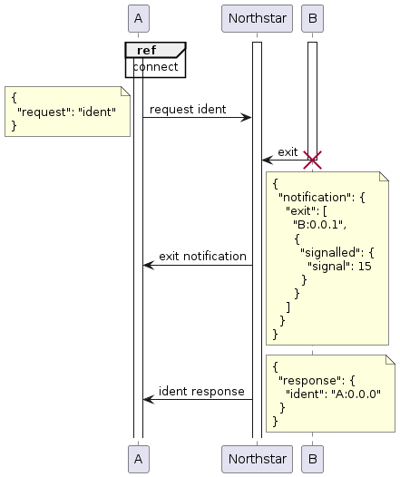
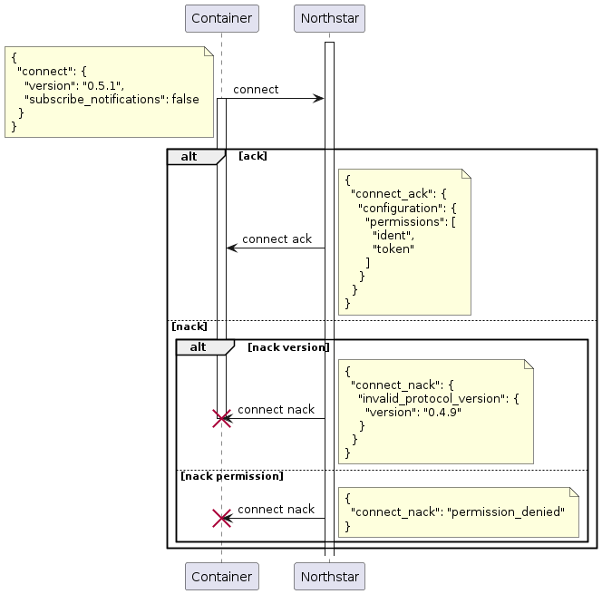
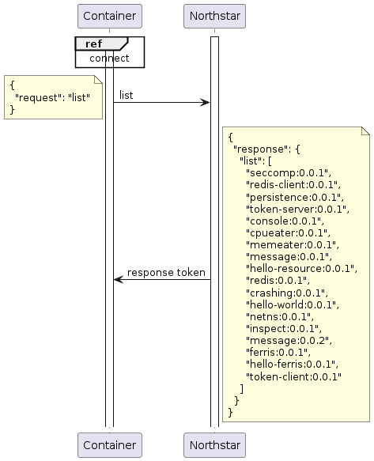
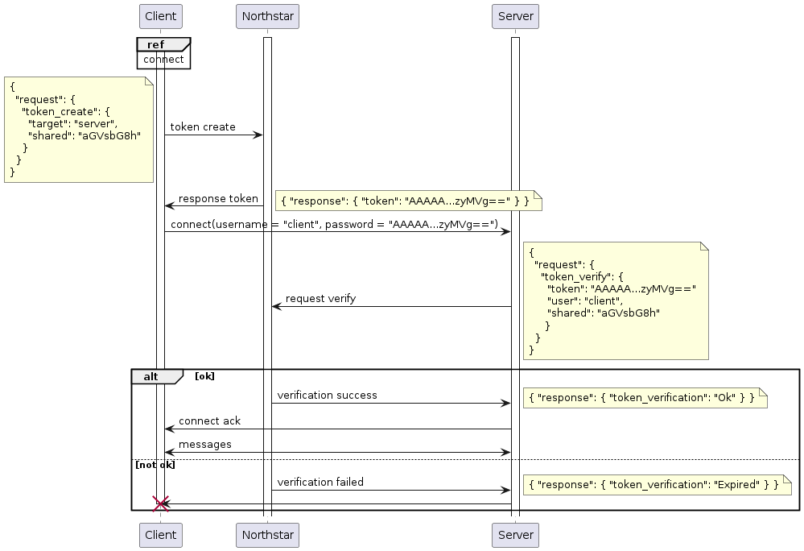

# Northstar Console

The Northstar console is a multi purpose interface for control messages to and
from the runtime. The console uses the stream based transports Unix Domain
Sockets and/or TCP. The framing on the transport layer is done by new line
separated JSON. Each *UTF-8* encoded JSON object is separated with a newline
`\n`. This means '\r\n' is also supported because surrounding white space is
implicitly ignored when parsing JSON values.

Example:

```json
{"request":{"start":{"container":"hello-world:0.0.1","arguments":[],"environment":{}}}}
{"response":{"start":{"ok":{"container":"hello-world:0.0.1"}}}}
```

## Connecting to the runtime

The console can be connected via two different approaches. For debugging
purposes the runtime configuration allows to configure system wide accessible
unix or tcp socket that exposes the runtime's console. This is done by the
`console.global` setting in the runtime configuration. The scheme of the url must
be either `tcp`, `unix` or `unix+abstract`.

```toml
[console.global]
bind = "tcp://localhost:4200"
permissions = "full"
```

or

```toml
[console.global]
bind = "unix:///tmp/northstar"
permissions = "full"
```

or

```toml
[console.global]
bind = "unix+abstract://northstar"
permissions = "full"
```

Debugging console listeners shall ***never*** be enabled in production. The
listening sockets shall never be used for ***anything*** related production
software. the debugging console is not restricted in any means. You have been
warned.

Containers shall ***never*** use the debugging console setting described above.
Containers can access the console by a connection opened by the runtime at
container startup. The connection is enabled with the `console` setting in the
manifest (see example `console`):

```yaml
console:
  permissions: [ident, notifications, inspect, kill, list]
```

 The runtime creates a connected socket prior to the container fork, that is not
 closed when the container execution enters the application context. The number
 of the file descriptor is communicated to the application via the
 `NORTHSTAR_CONSOLE` environment variable. This number may be different upon
 each start of the container. The application must authenticate to the runtime
 with the `Messages::Connect` sequence described [here](#connect).
 
## Permissions

Each connection has a dedicated set of permissions. Permissions are requests
that are allowed to be executed via a connection. The permissions of external
debugging connections are configured in the runtime configuration. See
[Connecting to the runtime].

The permissions of a console connection that is established from a started
container, are declared in the containers manifest. Container permissions cannot
be updated at runtime. See the manifest specification for details.

## Notifications

Events happening in the runtime can be broadcasted to all connected clients with
the `notification` permissions. The interest in notifications must be
communicated to the runtime during the [connect](#connect) sequence.
Notifications can be sent at any time, thus a client implementation must expect
a notification message in between a request and response.

<br/>

## Message sequences

### Connect

Every connection to the runtime must send a `Messages::Connect` message prior to
anything else and await a positive response (`Message::ConnectAck`).

<br/>

### List installed containers

The following sequence chart shows a basic query to the runtime: list all
installed containers.

<br/>

### Tokens

The Northstar tokens provice an easy to use mechanism for authentification and
verification between containers. A container can obtain a token from the
runtime. A token can be verified by the runtime if it is created by a specific
contianer and valid. A token in combination with the container name can be
semantically used like a username password combination. 

Tokens expire after the duration configured in the runtime configuration:

```toml
token_validity = "1m"
```

Full sequence of token creation and verification:

<br/>

The permission `token_verification` is needed to perform a token verification.
The permission `token_create` is needed to create tokens.

#### Target and User

A token is created for a `user`. The `user` string is implicitly the container
name that creates the token. The `target` string is the container name that can
verify the token. The names are tied in the runtime to a connection. Note that
`token_create` does ***not*** contain the `user` string and `verify_token` does
***not*** contain the `target` string.

A token created for `target` `foo` can only be verified by a container with the name `foo`. All other attemps to verify the token fail.

#### Shared

Each token is created with an additional component: `shared`. The `shared` part
in the token, can make each a token specific for a usecase. E.g a token created
to connect to service A will not be verified by service B. The `shared` part is
optional.

